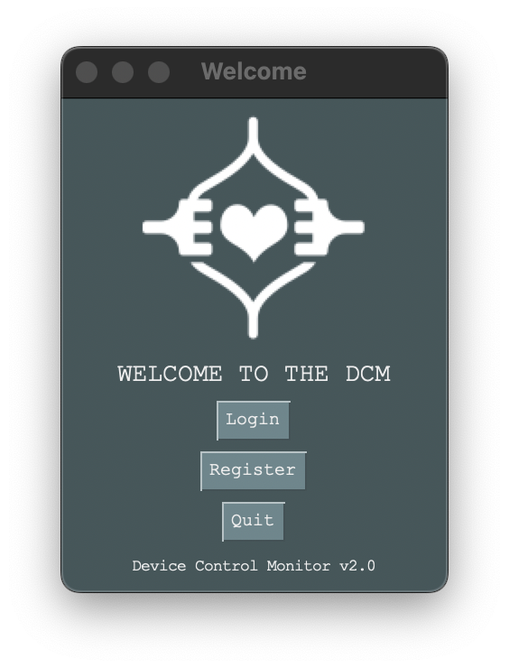
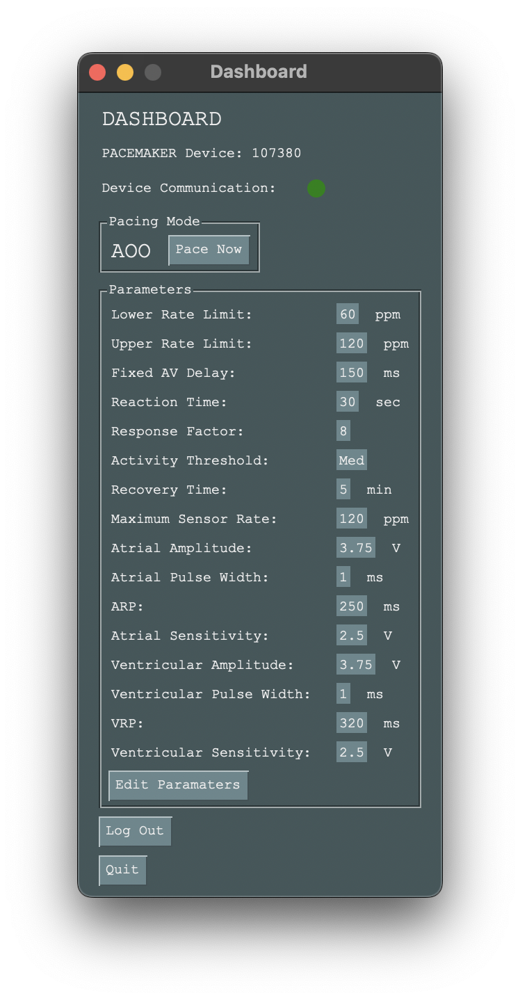
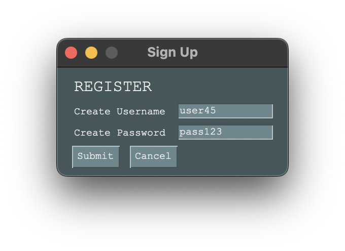
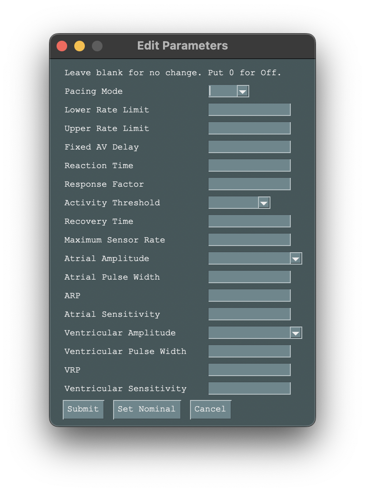

# PacemakerUI

PacemakerUI is a user-friendly and intuitive software designed to control and interact with a custom pacemaker machine. The software was developed as a part of a software engineering course 3K04. PacemakerUI is built entirely in Python, leveraging the power and simplicity of PySimpleGUI. This software is not just a bridge between the user and the device but also ensures the correctness of the input parameters and maintains the storage of both parameters and user data locally.



## Features
- User registration and login system.
- Display of all device parameters.
- Option to edit device parameters.
- Thorough input validation to prevent incorrect data transmission.
- Beautiful and intuitive UI.
- Data is transmitted through a binary structure via the serial port.
- Local storage of parameters and user data.
  



## Getting Started

### Prerequisites
To use the PacemakerUI, you need:

- Python 3.x
- PySimpleGUI
-  PySerial (for communication over the serial port)

### Installation
1. Clone the repo
```bash
git clone https://github.com/KhanxMo/PacemakerUI.git
```

2. Navigate into the project directory
   
```bash
cd PacemakerUI
```

3. Install the required dependencies
```bash   
pip install PySimpleGUI pyserial
```
4. Run the application
```
python DCM.py
```

## Usage
After successfully running the software, the user can create an account and log in to view and edit the device parameters.



The dashboard displays all the parameters, allowing users to monitor and modify them as required.



Please note that this software is designed for a specific custom pacemaker device, and hence, its use with other devices may require modifications.

## License
Distributed under the MIT License. See LICENSE for more information.

## Acknowledgments
PySimpleGUI
PySerial
